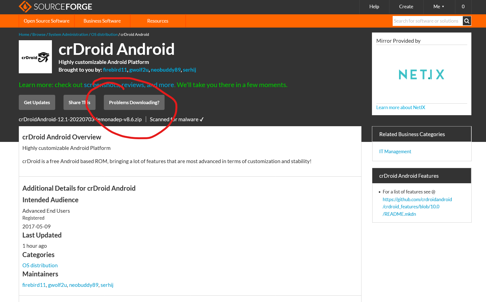
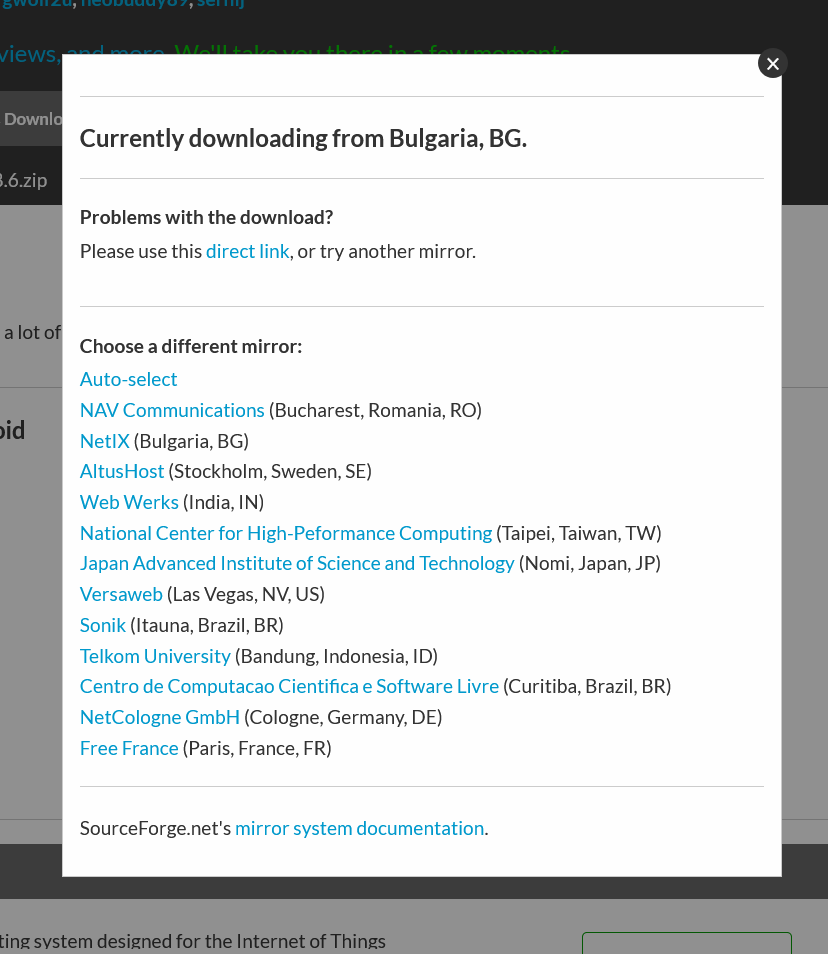

### Mirrors

SourceForge is our choice for helping distribute crDroid to you guys.  
*SourceForge.net* maintains a geographically-distributed network of mirror servers, which receive copies of the files and dispense them to users. Since mirror servers are located throughout the world, users can pick a server that is physically close to them and receive great transfer speeds.

### Selecting a mirror

There are times when network performance between two physically-close locations is poor.  
If you encounter slow downloads from a mirror, simply use the "**Problems Downloading?**" link to pick an alternate mirror.  
*Note:* If you're on mobile browser, use **desktop mode** for page load.

  
  

If you get an error downloading, please ensure you have turned off any ad blockers and download managers that may be interfering with the download process.
