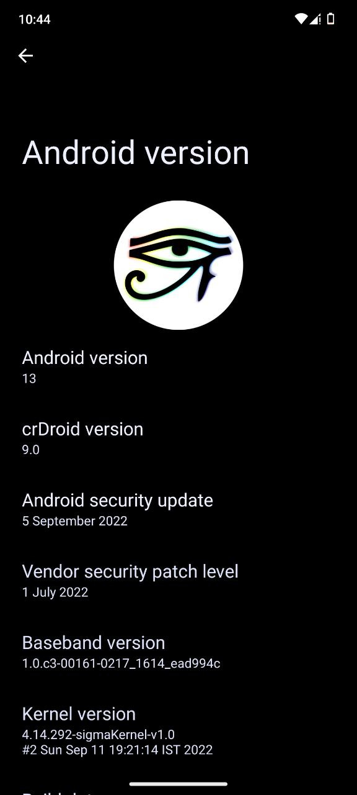

### crDroid 8.9 is released
With this build we've focused on following changes:

| Change |
| --- |
| Updated security patch level to 2022-09-05 |
| PixelPropsUtils: Update fingerprints to September 2022 release |
| Added ability to resize QS & Statusbar Clock |
| Dialer: Added toggle for post call snackbar |
| Dialer: Move Sensor settings to Other settings |
| Update statusbar burn-in protection shift base padding when orientation changed |
| Added smart charging |
| Added reset battery stats option |
| Update Chromium Webview to 105.0.5195.68 |
| Some small dark mode fixes |
| Updated translations |

Devices will get this update slowly pushed via OTA as soon as maintainers validate changes.

### crDroid 9 just booted
Can you guess what we're cooking here?
  
Yup is crDroid 9 based on just released Android 13.  
Expect it soon...