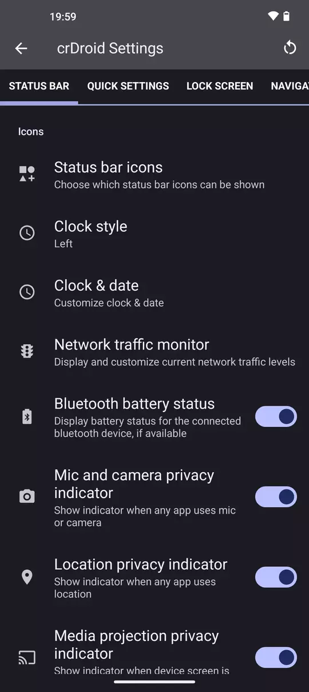
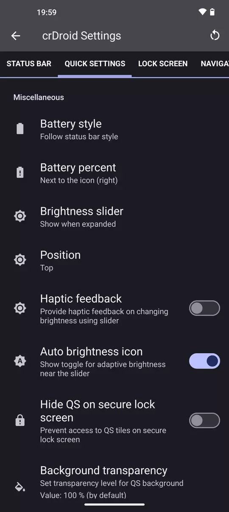
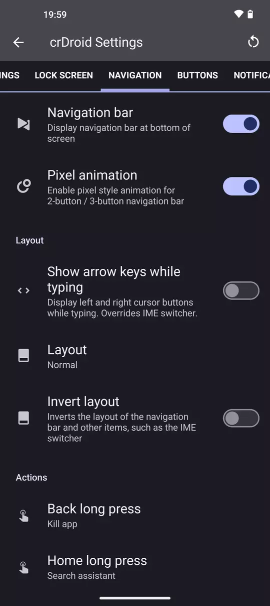
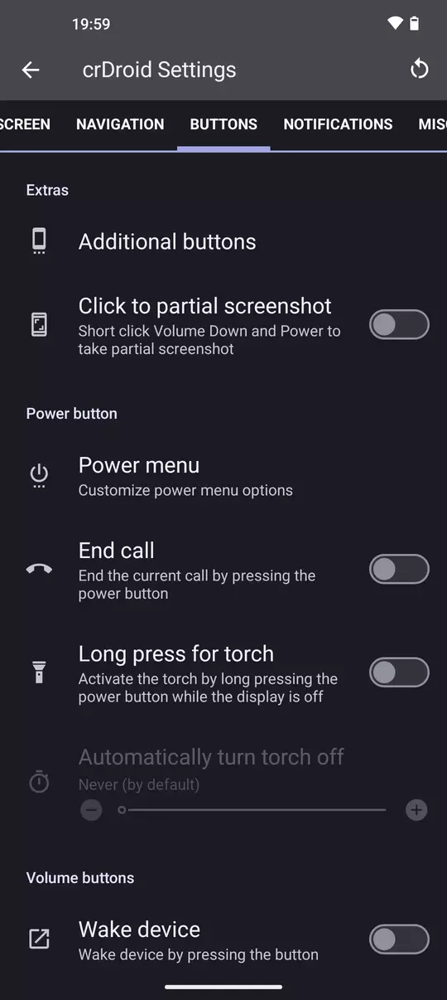
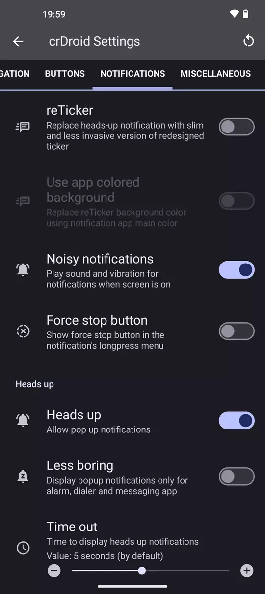
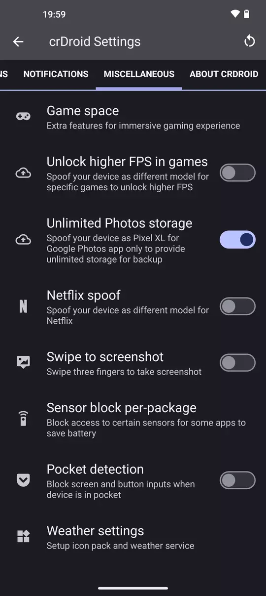

As most of ouf devices bingup stage is progressing good, we thought to post few screens of current status of crDroid 10.  
While we are still in Alpha stage, is just a matter of days until we will start to ship Beta builds.  
Our current planned release is Beta in November with stable release in December 2023.  
  
So with that out of the way, here are the screenshots.
  
  
  
  
  
  
  
  
  
