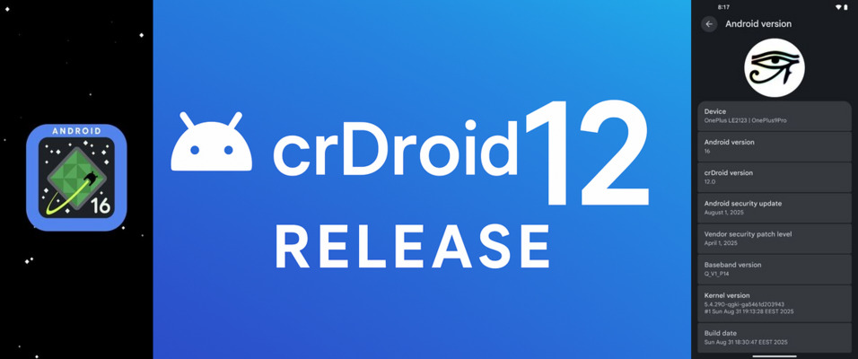

  

# crDroid 12 – Bringing Android 16 to the Spotlight

The wait is over — **crDroid 12** is here, and it comes packed with the latest and greatest: **Android 16**.  
This release marks a major milestone in keeping crDroid devices modern, secure, and performance-driven, while staying true to the project’s philosophy of *enhancing stock Android without compromising stability*.

## 🚀 What’s New in crDroid 12
- **Base updated to Android 16** – enjoy the latest platform improvements, APIs, and under-the-hood optimizations straight from Google.  
- **Security patches up to date** – keeping your device safe with the newest monthly security updates.  
- **Performance tuning** – smoother animations, optimized memory management, and refined system performance.  
- **Customization improvements** – more options to personalize your device without the bloat.  
- **Stability & bug fixes** – refined codebase and fixes to ensure a reliable daily driver experience.

## 🌟 Why Android 16 Matters
Android 16 isn’t just a version bump — it sets the stage for a future-proof mobile experience:  
- Improved **battery efficiency** with smarter background task handling.  
- Enhanced **privacy and permission controls**.   
- Under-the-hood optimizations that make everything run faster and more efficiently.  

With crDroid 12 adopting Android 16, users get the best of both worlds: the latest Android platform **plus** the flexibility and customization that crDroid is known for.

## 📱 Availability
crDroid 12 will gradually roll out to supported devices. Check the official [crDroid downloads page](https://crdroid.net/downloads) to see if your device is already listed and grab the latest build.

## 🔑 Final Thoughts
With **crDroid 12**, the project continues its mission of delivering a lightweight, customizable, and stable Android experience. The jump to **Android 16** ensures users not only stay secure but also enjoy the newest features the Android ecosystem has to offer.

Stay tuned for further updates, device-specific improvements, and the growing community around crDroid!

